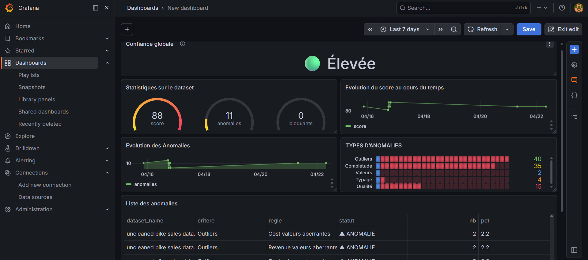

# Data Quality Scoring Platform (n8n + PostgreSQL + Grafana)

## Objectif

Ce projet propose un système automatisé de **Data Quality Scoring** permettant d’évaluer la fiabilité des données utilisées dans les systèmes décisionnels.

Il permet de :

* Vérifier automatiquement la qualité des datasets
* Détecter des anomalies (valeurs manquantes, incohérences, outliers…)
* Calculer un score de qualité global
* Fournir un niveau de confiance pour les KPI
* Visualiser les résultats via un dashboard interactif

---

##  Architecture

```
Docker
 ├── n8n (orchestration & traitement)
 ├── PostgreSQL (stockage des résultats)
 └── Grafana (dashboard & visualisation)
```

## Stack technique

* **n8n** → automatisation du workflow
* **JavaScript** → contrôle qualité des données
* **PostgreSQL** → base de données
* **Grafana** → dashboard de visualisation
* **Docker** → orchestration des services

---

## Workflow

1. Upload du dataset (CSV / Excel)
2. Extraction des données
3. Analyse de qualité :

   * complétude
   * cohérence
   * typage
   * valeurs aberrantes
4. Détection d’anomalies
5. Calcul du score de qualité
6. Stockage dans PostgreSQL :

   * table `data_quality`
   * table `data_quality_issues`
7. Visualisation dans Grafana

---

## Dashboard Grafana

Le dashboard permet de visualiser :

* Score global de qualité
* Nombre d’anomalies et de bloquants
* Niveau de confiance des données
* Évolution du score dans le temps 📈
* Typologie des anomalies
* Liste détaillée des anomalies



---

## 🗄️ Modèle de données

### Table `data_quality`

| Champ        | Description                |
| ------------ | -------------------------- |
| date_run     | date d’exécution           |
| dataset_name | nom du dataset             |
| score        | score de qualité           |
| anomalies    | nombre d’anomalies         |
| bloquants    | nombre d’erreurs critiques |
| confiance    | niveau de confiance        |

---

### Table `data_quality_issues`

| Champ   | Description                  |
| ------- | ---------------------------- |
| critere | type de contrôle             |
| regle   | règle appliquée              |
| statut  | OK / ANOMALIE / BLOQUANT     |
| nb      | nombre d’occurrences         |
| pct     | pourcentage                  |
| details | informations complémentaires |

---

## Installation

### 1. Cloner le projet

```bash
git clone https://github.com/adys-s/data-quality-scoring-n8n
cd data-quality-scoring-n8n
```

### 2. Lancer les services

```bash
docker-compose up -d
```

---

##  Accès aux services

* n8n → http://localhost:5678
* Grafana → http://localhost:3000

---

## Cas d’usage

Ce projet répond à un problème réel :

Les décisions business reposent souvent sur des données de mauvaise qualité, ce qui peut entraîner des erreurs coûteuses.

Ce système permet de :

* fiabiliser les données
* anticiper les problèmes
* améliorer la confiance dans les KPI

---

##  Améliorations possibles

* Ajout d’alertes Grafana (si score faible)
* Machine Learning avancé pour anomaly detection
* Automatisation planifiée (cron n8n)
* Intégration avec des sources de données réelles

---

##  Auteur

Yawa Silvere ADODO-DAHOUE
